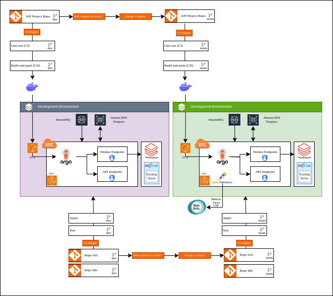

# Case Machine Learning Engineer

# Escopo

API com as rotas para servir o modelo

# Como executar ?

- Instanciar o [worker](https://github.com/JJader/worker-celery) e suas dependências (broker, backend db, MLFlow)

- rodar o comando `docker-compose up --builder`

- Acessar a rota swagger [http://0.0.0.0:8080/docs](http://0.0.0.0:8080/docs)

# Informações 

* A A API tem os seguintes endpoints:
    * `/model/predict/`
        * Endpoint onde deverá receber um payload com as informações do voo e retornar a previsão do atraso no destino
    * `/model/load/`
        * Endpoint onde deverá receber o arquivo .pkl do modelo e deixar a API pronta para realizar predições
    * `/model/history/`
        * Endpoint onde deverá exibir o histórico de predições realizadas (o payload de entrada + as saídas preditas)
    * `/health/`
        * Endpoint que irá retornar a saúde da API

# Arquitetura da aplicação

